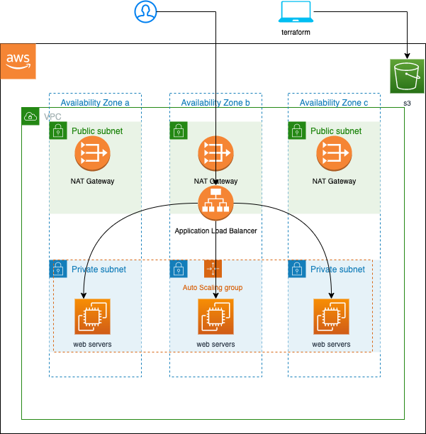

# Terraform for AWS Simple Web

This repo contains Terraform template to deploy a Simple Web site in a load balanced, highly available and highly resilient manner utilizing automation and [AWS best practices](https://docs.aws.amazon.com/whitepapers/latest/web-application-hosting-best-practices/an-aws-cloud-architecture-for-web-hosting.html). 

Following the cloud architecture recommended by AWS, it starts from provisiong the networking infrastrucutre including VPC, public/priviate subnets, Internet gateway, NAT gateway, route tables and associations, as well as security groups. Subsequently the web server instances would be provisioned using AWS Auto Scaling Group, together with the target group which performs basic health check and application load balancer which would evently distribute the requests  to the web server nodes in each availability zone. A simple user-data script is employed to install the apache server with a basic hello page. 

The diagram below provides an overview of the architecuture and some components for the **Simple Web** on AWS.




## Requirements
- aws account with right permissions
- terraform installed locally as per [this tutorial](https://learn.hashicorp.com/tutorials/terraform/install-cli)
- ssh key pair generated on AWS, a sample cli below
    ```
    aws ec2 create-key-pair --region ap-southeast-2 --key-name simple-web-key --query 'KeyMaterial' --output text >> my_simple_web_key.pem
    ```
- the `tfvars` file for relevant environment has been reviewed and updated accordingly before running the modules
- an account from https://keybase.io if using [pgp key encryption](https://www.linkedin.com/pulse/secret-management-w-key-base-terraform-easy-way-jrtlabs/) for terraform user access key


## Usage 

### Preparation
Before the actual deployment, we will prepare the environment with the [simple_web_init](./simple_web_init) module
- run terraform apply

  ```bash
  terraform -chdir=simple_web_init init
  terraform -chdir=simple_web_init apply
  ....
  
  Do you want to perform these actions?
    Terraform will perform the actions described above.
    Only 'yes' will be accepted to approve.
  
    Enter a value: yes
  
  ....
  
  Outputs:
  
  aws_access_key_id = "...."
  aws_secret_access_key = <sensitive>
  ```

- retrieve the access key from output
  ```
  terraform -chdir=simple_web_init output aws_secret_access_key
  ```
- optionally, if the encryption is enabled with pgp_key from keybase, decrypt the access key with following command
   ```
   terraform -chdir=simple_web_init output -raw aws_secret_access_key_pgp_encrypted |base64 --decode |keybase pgp decrypt
   ```

- create an aws profile with the access id and key in the aws credentials file _~/.aws/credentials_ 
  ```
  [terraform-user-profile]
  aws_access_key_id = ....
  aws_secret_access_key = ....
  ```

### Deployment
- initialise the [simple_web_deploy](./simple_web_deploy) module  with the S3 backend config file generated from the preveious module

  ```bash
  terraform -chdir=simple_web_deploy init -backend-config=files/s3_backend_config 
  ```

- optionally, create a new workspace named `dev` to differentiate with future production envnironment

  ```bash
  terraform -chdir=simple_web_deploy workspace new dev
  ```
- deloy **Simple Web** with var file

  ```bash
  terraform -chdir=simple_web_deploy apply -var-file=env/dev/simple_web.tfvars
  ....
  Apply complete! Resources: 42 added, 0 changed, 0 destroyed.
  
  Outputs:
  
  bastion_host_public_ip = "1.1.1.1"
  web_url = "http://web-server-alb-<...>.ap-southeast-2.elb.amazonaws.com"
  ```
The output lists out the public I of the bastion host and URL of the Loadbalancer for a quick look at **Simple Web**. Refresh the page can see different hostname of the 3 web servers behind the LB.

## Design considerations
Some thoughts have been put into the development of this solution to address the following perspectives of this mini project.

### Security
- A dedicated terraform user is created with restricted IAM policies so it won't interfere with other IAM users/roles, especially not with users with administrative permissions. By default the access key would be stored as plain text in the state file of the [simple_web_init](./simple_web_init) module. But the encryption capability has been embedded in the solution by making use of `pgp_key` created with [keybase](https://keybase.io) account
  - The IAM policies can be finetuned to have more granular control at individual operation
  - The storage and access to the key can be further improved by leveraging the capabilities provided by enterprise secrets management services such as [AWS Secrets Manager](https://aws.amazon.com/secrets-manager/), or [Hashcorp Vault](https://www.vaultproject.io/)
  - Best practices for working with AWS IAM can be found at https://docs.aws.amazon.com/IAM/latest/UserGuide/best-practices.html

- Although terraform [tls provider](https://registry.terraform.io/providers/hashicorp/tls/latest/docs/resources/private_key) provides utilities to generate TLS keys, the private key would be stored unencrypted in terraform state file which has potential security risk if not managed properly. Hence it is recommended to generate the SSH key outside of terraform as per the sample aws command mentioned in the requirements. 
  - Again secrets and encryption management systems can be employed to provide the protection as required by the business.

- As recommended by the web hosting pratice, the web servers are kept within private subnets without direct access to the internet. Security group rules has been provisioned to allow only HTTP access from Loadbanlancer deployed in public subnet. An optional bastion host is provisioned for troubleshooting or manamagement access, of which the SSH access is only allowed from the public IP of your laptop.
  - to further secure the web server or any internet facing solutions, we can use SSL to encrypt the HTTP requests between end users and application load balancer
  - [AWS WAF](https://aws.amazon.com/waf/) and other format of firewalls are the enterprise level solutions to protect your web applications or APIs against common web exploits and bots that may affect availability, compromise security, or consume excessive resources.


### High Availability
- By default, one instance of web server per availability zone is provisioned to provide high availablity of the **Simple Web** cluster, which is managed by the Auto Scaling Group. If the web service (port 80) is down, ASG would automatically bring up a new web server defind with Launch Template and terminate the one in trouble.
  - For production or enterprise deployment, more sophisticated health check rules should be considered and embedded into the health check rules to provide more robust and elastic HA architecture. 


### Modular design
- the [simple_web_deploy](./simple_web_deploy) module uses two child modules to deploy the networking infrastrcture and ec2 instance separatly which provides better readability, maintainability, re-usability from code perspective
  - it can be further improved by adopting layered approach as recommended by [this article](https://skundunotes.com/2021/09/26/strengthen-security-posture-with-terraform-and-aws-iam-to-manage-aws-cloud-resources/) but need to find a balance with the project and team


## Improvements
Here are a list of best wishes to make the solution works better and safer
- to use AWS Secrets Manager or Hashicorp Vault to store and rotate the secrets 
- to enforce server side encryption of remote state file on S3 bucket using KMS
- to update web server nodes with more readable names by using a bit scripting in user-data


## Attributions
Thanks to internet and open source community, the following sites or articles have provided tremendous help during the development of the **Simple Web**. A sincerely thank you from the bottom of my heart.
- https://registry.terraform.io/providers/hashicorp/aws/latest/docs
- https://docs.aws.amazon.com/IAM/latest/UserGuide/best-practices.html
- https://medium.com/paul-zhao-projects/terraforming-an-aws-vpc-7cf13d0bd99a
- https://stackoverflow.com/questions/47913041/initial-setup-of-terraform-backend-using-terraform
- https://skundunotes.com/2021/09/26/strengthen-security-posture-with-terraform-and-aws-iam-to-manage-aws-cloud-resources/
- https://www.linkedin.com/pulse/secret-management-w-key-base-terraform-easy-way-jrtlabs/
